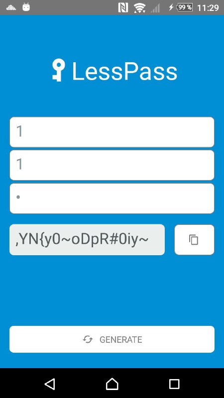

> native iOS and Android LessPass application with react-native



**Only Android supported as for now**

# Build

## Prerequirements:
React-native and Android studio installed. [Guide here.](https://facebook.github.io/react-native/docs/getting-started.html) 

## Build process
1. Clone project
2. Run ```npm install```
3. Run ```react-native run-android```


## License

This project is licensed under the terms of the GNU GPLv3.


## Issues

report issues on [LessPass project](https://github.com/lesspass/lesspass/issues)